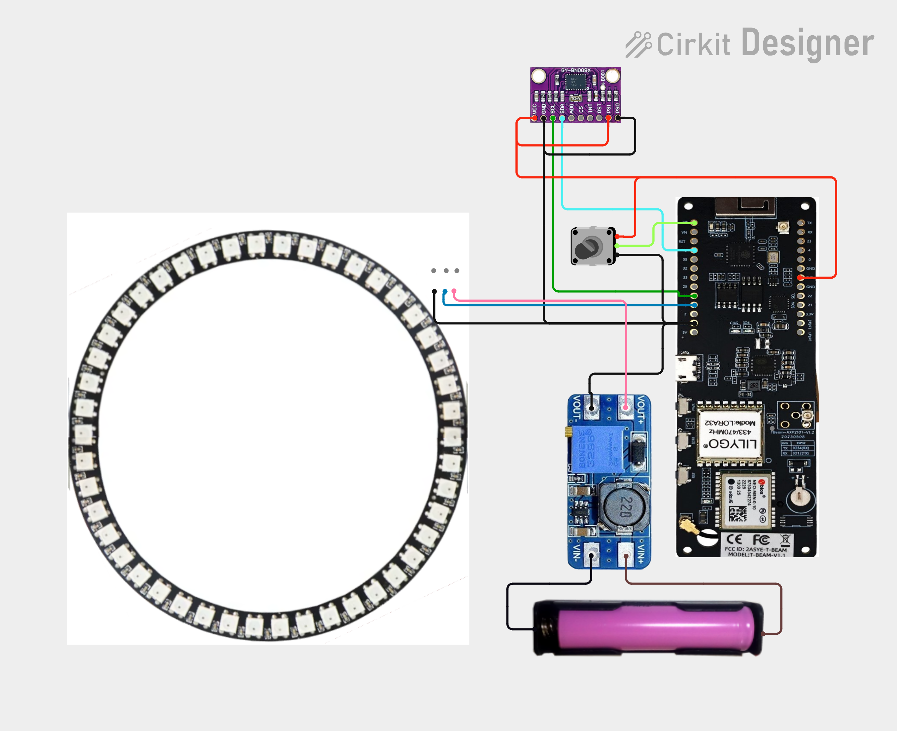
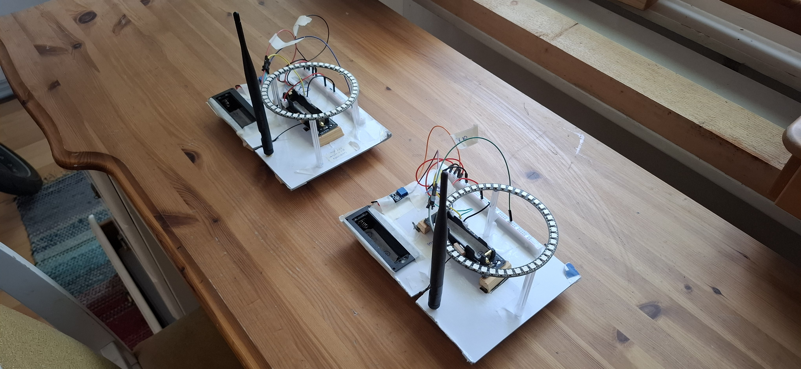
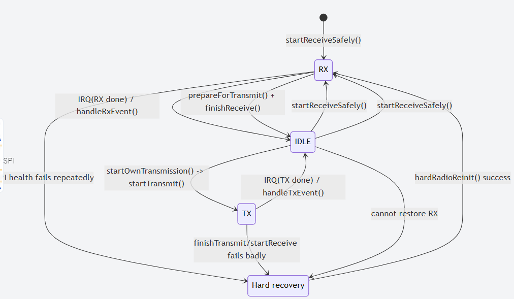
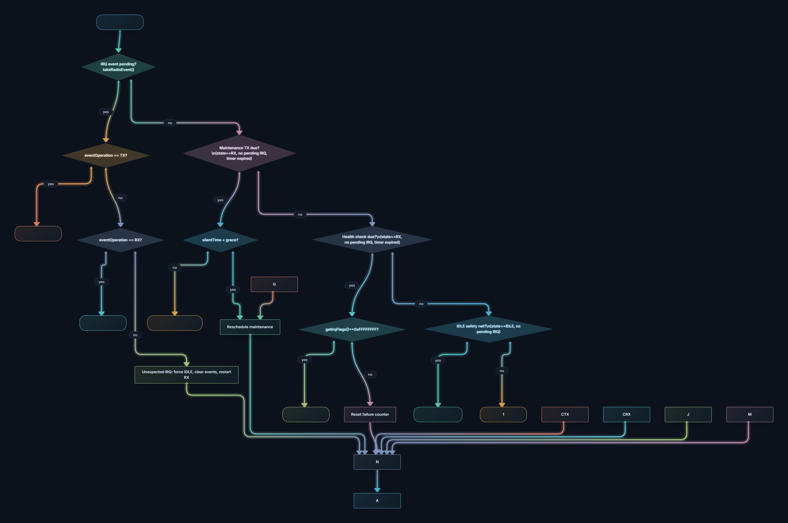

# Buddy finder compass LoRa Link 

25.9.2026: I have added a  potentiometer to pin "VP" treated as GPIO36 inside the program.


## The main idea:

It’s like a “hot-and-cold” game, but instead of saying “warmer,” it simply points you in the right direction with a light.
 
Imagine two friends each carrying a small “helper gadget” when they go hiking, exploring, or looking for something. 

It is "off grid", not depending on access to phone or internet  

## What the gadget does:
- ✅ It knows which way you are facing
Like a compass, it can tell whether you’re pointing toward north, south, east, or west. 
 
- ✅ It knows where your buddy is (roughly)
Your friend’s gadget and your gadget can “talk” to each other from far away, even if you can’t see each other.
 
- ✅ It tells you which direction to walk to reach them
Your gadget compares:
 
- ✅ where you are,
where your buddy is,
and which way you’re facing,
Then it figures out: “Your buddy is that way.”
 
- ✅ It shows the direction in a super simple way
Instead of showing a map or numbers, it uses a circle of lights:
 
- ✅ If the buddy is in front of you, the LED at the “front” glows.
If they’re to your left, the LED on the left glows.
If they’re behind you, a LED at the back glows.
So you just turn until the “go that way” LED is in front, then walk forward


## How you’d use it in real life:

### Situation A: Two people in the woods/mountains/desert/night
Both people carry one gadget.
If you get separated, look at your LED compass ring ring.
Turn your body until the “correct” LED is at the front.
Walk that way.
Check again sometimes (because your buddy may also be moving).


### Situation B: Finding your dog
Put one gadget on the dog’s collar, and carry the other yourself.
If the dog runs off, look at your lights.
Turn until the “correct” light is in front.
Walk that way, checking again as you go.

## Technical explanation

A minimal two-device project using **two LILYGO T-Beam V1.2 (ESP32 + SX1262)** boards to communicate over **LoRa** in the **EU 868 MHz** band.

The program is  a "ping - pong" program between two ESP32 (T-BEAM) with LORA communication. Both T-BEAM transmit regularly their GPS position to each other.  Each LILYGO T-Beam LORA32 868MHz module is connected  with a BNO085 sensor through a UART bus. The LILYGO T-Beam serves as the main microcontroller and communication module, while the BNO085 sensor measures the spatial orientation of the device, i.e., where the device itself is pointing in relation to the North Pole.  Because the device knows its own orientation and also the location of the second "buddy" device, it now can calculate the direction in which the other buddy device is located. This direction is then displayed using a so-called WS2812B LED Pixel Individually Addressable Ring.

---

## Electrical circuit diagram



## Photo




## ---

**2\. Component List**

### **2.1 LILYGO T-Beam Meshtastic LORA32 915 MHz**

**Function:**  
Main controller and communications platform.  
**Primary functions in this circuit:**

> * Runs the ESP32 firmware.  
> * Interfaces with the BNO085 orientation sensor.  
> * Reads the potentiometer.  
> * Controls the NeoPixel ring.  
> * Communicates using the integrated SX1262 LoRa radio.  
> * Controls GPS power through the onboard AXP2101 power-management IC.  
> * Provides the 3.3 V logic and sensor supply.  
> * Provides the battery-independent boost-converter control interface through the rest of the system.

Relevant pins used by this circuit include:

> * 3V3 — 3.3 V supply for the BNO085 and potentiometer.  
> * GND — circuit ground.  
> * 14 — BNO085 clock/receive-side interface connection.  
> * 15 — BNO085 data/transmit-side interface connection.  
> * 13 — NeoPixel data output.  
> * VP — potentiometer wiper analog input.


The board also contains the LoRa radio used by the firmware, although the radio connections are internal to the T-Beam and are not listed as external nets.

### ---

**2.2 BNO085**

**Function:**  
Orientation and rotation-vector sensor.  
The firmware uses the BNO085 rotation-vector report to calculate yaw. The calculated yaw is converted to degrees and used to determine the direction displayed on the LED ring.  
The sensor is operated using its serial-compatible interface in the supplied wiring:

> * SDA/MISO/TX  
> * SCL/SCK/RX

The PS1 and PS0 pins select the sensor interface mode. In this circuit, they are tied to 3.3 V and ground respectively.

   

### ---

**2.3 NEOPIXEL WS2812 45 LED RING**

**Function:**  
Visual direction indicator.  
The firmware lights one LED corresponding to the calculated companion bearing. The ring contains 45 addressable WS2812-type RGB LEDs.  
The ring receives:

> * Approximately 5 V power from the MT3608.  
> * Ground from the common circuit ground.  
> * A serial data signal from T-Beam pin 13\.

The D0 pin is not connected in the supplied wiring. The ring is therefore driven through D1.


### ---

**2.4 18650 Battery Holder**

**Function:**  
Single-cell battery source.  
The holder provides the input supply to the MT3608 boost converter:

> * VCC connects to VIN+.  
> * GND connects to VIN-.

The design assumes a suitable protected 18650 cell or an equivalent battery-protection arrangement. The battery voltage varies with charge state and should remain within the MT3608 input specification.

### ---

**2.5 MT3608 Boost Converter**

**Function:**  
Raises the 18650 battery voltage to the voltage required by the NeoPixel ring.  
The converter input is connected to the battery holder. Its output is connected to the LED ring:

> * VIN+ — battery positive.  
> * VIN- — battery negative.  
> * VOUT+ — NeoPixel ring 5 V supply.  
> * VOUT- — common ground.

The MT3608 output voltage must be adjusted and verified before connecting the LED ring. A nominal 5 V output is recommended for the specified LED ring.

### ---

**2.6 Potentiometer**

**Function:**  
Provides a user-adjustable heading correction.  
The potentiometer is wired as a voltage divider:

> * A — connected to 3.3 V.  
> * E — connected to ground.  
> * S — wiper output connected to T-Beam pin VP.

The firmware reads the wiper voltage using ESP32 ADC pin 36 and maps the ADC range to an angular correction of approximately 0–360 degrees.

## ---

**3\. Component Wiring Details**

## **3.1 LILYGO T-Beam Meshtastic LORA32 915 MHz Wiring**

| T-Beam pin | Connected to | Function   |
| :---- | :---- | :---- |
| 3V3 | BNO085 VCC | 3.3 V sensor supply |
| 3V3 | BNO085 PS1 | Interface-mode selection |
| 3V3 | Potentiometer A | Potentiometer supply |
| GND | BNO085 GND | Common ground |
| GND | BNO085 PS0 | Interface-mode selection |
| GND | MT3608 VOUT- | Common ground |
| GND | Potentiometer E | Potentiometer ground |
| GND | NeoPixel ring GND | LED-ring ground |
| 15 | BNO085 SDA/MISO/TX | BNO085 serial data connection |
| 14 | BNO085 SCL/SCK/RX | BNO085 serial clock/data connection |
| 13 | NeoPixel ring D1 | WS2812 data signal |
| VP | Potentiometer S | Analog wiper input |

### **Unconnected T-Beam pins of interest**

The following T-Beam pins appear in the part definition but are not connected by the supplied net list:

> * TX  
> * RX  
> * 23  
> * 4  
> * 0  
> * SCL/22  
> * SDA/21  
> * LoRa2  
> * 5V  
> * 2  
> * 25  
> * 33  
> * 32  
> * 35  
> * RST  
> * VN

The integrated LoRa radio is used by the software, but its internal connections are not represented as external wiring in the supplied net list.

## ---

**3.2 BNO085 Wiring**

| BNO085 pin | Connected to | Function   |
| :---- | :---- | :---- |
| VCC | T-Beam 3V3 | 3.3 V supply |
| GND | T-Beam GND | Ground |
| PS1 | T-Beam 3V3 | Interface-mode configuration |
| PS0 | T-Beam GND | Interface-mode configuration |
| SDA/MISO/TX | T-Beam 15 | Serial data connection |
| SCL/SCK/RX | T-Beam 14 | Serial clock/data connection |

The following BNO085 pins are not connected in the supplied net list:

> * ADR/MOSI  
> * CS  
> * INT  
> * RST

### **Interface note**

The BNO085 is configured in the firmware using the Adafruit begin\_UART() method on Serial2. The exact UART signal direction and the required board-specific pin mapping should be checked against the particular BNO085 breakout board. The supplied net list identifies the connections as T-Beam pins 14 and 15, but the code refers to configuration macros PIN\_BNO\_RX and PIN\_BNO\_TX, whose definitions are not included.

## ---

**3.3 NeoPixel WS2812 45 LED Ring Wiring**

| LED-ring pin | Connected to | Function   |
| :---- | :---- | :---- |
| 5V | MT3608 VOUT+ | LED-ring supply |
| GND | Common ground | LED-ring return |
| D1 | T-Beam 13 | WS2812 data input |

The D0 pin is not connected.

### **Power considerations**

A 45-LED WS2812 ring can require substantial current when many LEDs are illuminated at high brightness. The maximum theoretical current can approach approximately:

> * 60 mA per LED at full white  
> * Approximately 2.7 A for 45 LEDs

The supplied firmware sets a configurable brightness, which reduces typical current consumption. The MT3608, battery, wiring, and connectors must nevertheless be rated for the expected load.  
A bulk capacitor near the LED-ring power input and a suitable series resistor in the data line are commonly recommended, although neither is included in the supplied component list.

## ---

**3.4 18650 Battery Holder Wiring**

| Battery-holder pin | Connected to | Function   |
| :---- | :---- | :---- |
| VCC | MT3608 VIN+ | Battery positive |
| GND | MT3608 VIN- | Battery negative |

The battery holder has no direct connection to the T-Beam in the supplied net list. The T-Beam’s own power input and battery-management connections are therefore not documented by the provided wiring data.

## ---

**3.5 MT3608 Boost Converter Wiring**

| MT3608 pin | Connected to | Function   |
| :---- | :---- | :---- |
| VIN+ | 18650 holder VCC | Battery input positive |
| VIN- | 18650 holder GND | Battery input negative |
| VOUT+ | NeoPixel ring 5V | Boosted LED supply |
| VOUT- | Common ground | Boosted supply return |

The MT3608 output voltage should be set with a multimeter before connecting the LED ring. The output should be adjusted to the required LED-ring voltage, normally approximately 5 V.

## ---

**3.6 Potentiometer Wiring**

| Potentiometer pin | Connected to | Function   |
| :---- | :---- | :---- |
| A | T-Beam 3V3 | Upper voltage-divider supply |
| E | Common ground | Lower voltage-divider return |
| S | T-Beam VP | Wiper voltage |

The firmware reads the analog voltage and maps it to an angular correction:

> * Minimum wiper voltage: approximately 0 degrees.  
> * Maximum wiper voltage: approximately 360 degrees.

The actual direction of increasing correction depends on which outer potentiometer terminal is connected to 3.3 V.


---

## What is LoRa?

**LoRa** (Long Range) is a wireless modulation technology developed by Semtech that enables low-power, long-range communication for IoT (Internet of Things) devices. It uses a proprietary spread-spectrum technique called Chirp Spread Spectrum (CSS) to achieve:

- **Long range:** Up to 15+ km in rural areas, 2-5 km in urban environments
- **Low power:** Devices can operate for years on a single battery
- **Low data rate:** Typically 0.3 kbps to 50 kbps (perfect for sensor data)
- **Excellent penetration:** Can penetrate buildings and obstacles better than WiFi/BLE

LoRa operates in the license-free ISM bands (868 MHz in Europe, 915 MHz in North America, 433 MHz in Asia). It's ideal for applications like:
- GPS tracking
- Environmental monitoring
- Smart agriculture
- Asset tracking
- Smart city sensors

---


## Software Overview

This repository contains the program "main" using the **RadioLib** library to control the **SX1262 LoRa radio** on the T-Beam.
In this branch GPS_bearing, the distance and bearing between "self" T-BEAM and "companion T-BEAM" is calculated.

## Program Logic (How it works)


### 1) **GPS Initialization & Configuration**

   - Powers the GPS module via the AXP2101 PMIC (power management IC) The program attempts to communicate with the AXP2101 chip (which manages the voltages). If it finds a signal, it activates the output that powers the GPS (3.3V). Otherwise, it displays a warning.


   - Configures the u-blox GPS to output only UBX binary protocol (disables NMEA sentences) Enables NAV-PVT (Position, Velocity, Time) messages at 1Hz rate on UART1
   - Initializing the GPS serial port:
    This opens a 9600 baud UART connection between the ESP32 and the GPS (pins 34 for receiving, 12 for transmitting).

   - Configuring the GPS:
    By default, the GPS sends many NMEA sentences (GGA, GSA, RMC, etc.). The program disables them all one by one by sending UBX configuration commands.

   - Then it activates a single UBX message called NAV-PVT (which contains the  position, speed, time, altitude, etc.).
    For each command, it waits for the GPS acknowledgment response (ACK or NAK) and displays whether it was successful.


### 2) **UBX Protocol Parsing**
   - Implements a robust state machine parser for UBX binary protocol
   - Extracts latitude, longitude, fix type, and validity flags from NAV-PVT frames
   - Stores the latest valid position data
   


### 3) (`main.cpp`)
This sketch makes two ESP32 T‑Beam boards “take turns” talking over LoRa. One board starts by sending a first message (because #define INITIATING_NODE is enabled). After that, the devices alternate like a ping‑pong game:


#### How it works (high level)
Each node normally stays in **LoRa receive mode (RX)**.
When a packet is received, an interrupt (DIO1) fires and the main loop reads and parses the payload.

To avoid RX/TX race conditions between the interrupt and the main loop, the firmware uses:
- a protected radio state (`IDLE`, `RX`, `TX`)
- an IRQ event counter (no lost interrupts)
- the ISR captures which operation (RX/TX) was active when the interrupt occurred

#### Link recovery (quiet channel is not a failure)
If both nodes end up listening (RX) and no packets arrive, the link can deadlock.
A periodic **maintenance transmission** is used to “kick” the link back into activity when no valid packet has been received for a while.

#### Real radio health check
Silence is treated as normal.
A hard recovery is only triggered if the SX1262 appears unresponsive over SPI (repeated failed IRQ flag reads).

#### Serial output
The firmware prints lines like:

```csharp
24.667753, 262.931436, 3, 3, true, true
```

#### State diagrams

```csharp
stateDiagram-v2
  [*] --> RX: startReceiveSafely()

  RX --> IDLE: IRQ(RX done) / handleRxEvent()
  IDLE --> RX: startReceiveSafely()

  RX --> IDLE: prepareForTransmit() + finishReceive()
  IDLE --> TX: startOwnTransmission() -> startTransmit()

  TX --> IDLE: IRQ(TX done) / handleTxEvent()
  IDLE --> RX: startReceiveSafely()

  state "Hard recovery" as REC
  RX --> REC: SPI health fails repeatedly
  TX --> REC: finishTransmit/startReceive fails badly
  IDLE --> REC: cannot restore RX
  REC --> RX: hardRadioReinit() success

```



#### Mermaid diagram

```csharp
flowchart TD
  A[loop() start: now=millis()] --> B{IRQ event pending? takeRadioEvent()}
  B -- yes --> C{eventOperation == TX?}
  C -- yes --> CTX[handleTxEvent(): finishTransmit -> startReceiveSafely]
  C -- no --> D{eventOperation == RX?}
  D -- yes --> CRX[handleRxEvent(): readData/parse -> startReceiveSafely]
  D -- no --> CX[Unexpected IRQ: force IDLE, clear events, restart RX]

  B -- no --> E{Maintenance TX due? \n(state==RX, no pending IRQ, timer expired)}
  E -- yes --> F{silentTime < grace?}
  F -- yes --> FS[Reschedule maintenance]
  F -- no --> G[startOwnTransmission():\nfinish RX -> TX -> send GPS]
  G --> FS

  E -- no --> H{Health check due?\n(state==RX, no pending IRQ, timer expired)}
  H -- yes --> I{getIrqFlags()==0xFFFFFFFF?}
  I -- yes --> J[Increment failures;\nif >=3 -> hardRadioReinit()]
  I -- no --> K[Reset failure counter]
  H -- no --> L{IDLE safety net?\n(state==IDLE, no pending IRQ)}
  L -- yes --> M[startReceiveSafely() else hardRadioReinit()]
  L -- no --> N[delay(1)]
  CTX --> N
  CRX --> N
  CX --> N
  FS --> N
  J --> N
  K --> N
  M --> N
  N --> A
```




Interrupt + event handling

#### setFlag() (ISR)
Minimal interrupt handler. It does not touch SPI or Serial. It only:
captures current radioOperation into irqEventOperation
increments irqEventCount
#### takeRadioEvent(operation)
Atomically checks if an IRQ event exists; if yes, consumes one event and returns the captured operation (RX/TX/IDLE). This is the core “no lost events + no misclassification” mechanism.
#### radioEventPending()
Just checks if irqEventCount != 0 (atomic). Used to avoid starting a new operation while an old event is still waiting.
#### setRadioOperation(state) / getRadioOperation()
Atomic setters/getters for the shared radio state.
#### clearRadioEvents()
Clears pending events. Used only when you know you are transitioning cleanly and want to discard stale IRQ bookkeeping.

Radio configuration + safe transitions

#### configureRadio()
Applies LoRa parameters (SF10, BW125, CR4/7, TX power 14). Called in setup and after hard recovery.
#### startReceiveSafely()
Starts RX in a race-safe way:
refuses to start if an IRQ event is still pending
sets logical state to RADIO_RX before calling radio.startReceive()
if start fails, returns to IDLE
#### prepareForTransmit()
Ensures you are not still receiving before TX:
if in RX: calls radio.finishReceive() then sets IDLE
clears old events
prevents “TX while already TX”
#### startOwnTransmission()
The “send my GPS” action:
calls prepareForTransmit()
sets state to TX before starting transmit
calls prepareAndSendOwnInfo() (which parses UBX and calls radio.startTransmit())
if both fixes exist, computes and prints distance/bearing

RX/TX completion handlers

#### handleTxEvent()
Runs when TX-done IRQ is consumed:
sets state to IDLE
finishTransmit()
then restarts RX (startReceiveSafely())
if anything fails badly → hardRadioReinit()
#### handleRxEvent()
Runs when RX-done IRQ is consumed:
sets state to IDLE (important for race fix)
readData(str)
if OK: parse payload into companion (UbloxHelper_parseGpsPayload)
restarts RX
if restart fails → hardRadioReinit()
Link maintenance + health recovery
scheduleMaintenanceTransmission()
Sets the next time a “maintenance TX” is allowed. Initiator and non-initiator use different intervals.
hardRadioReinit()
Full recovery path when the chip seems unhealthy:
resets software state + clears events
radio.reset(), then radio.begin()
reapplies LoRa settings
reinstalls DIO1 ISR
restarts RX

GPS-related modules

#### AXP2101_beginAndEnableGPSPower()
Powers the GPS rail via AXP2101 (DLDO1 3.3V). Without this, GPS may be off.

#### UbloxHelper_configureUbxOnlyNavPvt()
Configures u-blox to:
disable NMEA on UART1
enable UBX-NAV-PVT output
configure constellations (GPS/Galileo/GLONASS)
save config
#### prepareAndSendOwnInfo()
parses UBX stream (NAV-PVT) to update latest fix
formats a text payload LAT=... LON=... valid=... fixType=...
starts LoRa transmit


### 4) Calculation of the angle and distance

For the distance calculation, the Haversine is used [Wikipedia about Haversine](https://en.wikipedia.org/wiki/Haversine_formula)

to find the bearing (direction angle) from one GPS point to another, the function treats Earth like a sphere and uses trigonometry. First, it converts both locations’ latitude and longitude from degrees to radians (because math functions expect radians). Then it looks at the difference in longitude between the two points and computes two values that represent how far “east/west” and “north/south” the second point is relative to the first on the globe. Using atan2(y, x), it turns those into an angle. Finally, it converts the angle back to degrees and normalizes it to 0–360°, where 0° is north, 90° east.


## Features

- ✅ “ping pong” LoRa link 
- ✅ Pong calculates distance and bearing of Ping and vice-versa 
- ✅ Uses **EU 868 MHz** frequency
- ✅ Serial logging for easy debugging
- ✅ Built with **PlatformIO** + Arduino framework
- ✅ Uses **RadioLib** (SX1262 support)

---

## Hardware / Components Used

### Boards
- **2× LILYGO T-Beam V1.2**
  - MCU: **ESP32**
  - LoRa radio: **SX1262**
  - GPS: **NEO-M8N**
  - PMU: **AXP2101**
  - USB-UART: **CH9102**
  - Flash: 4MB, PSRAM: 8MB
  - Marking: *LILYGO 868/915 MHz Model: LORA32 SX1262*

### Region / Frequency
- **Europe (EU): 868 MHz** is used in the code:
  - `static const float LORA_FREQ = 868.0;`

> ⚠️ Always follow your local radio regulations (frequency, transmit power, duty cycle).

## Dependencies / Libraries Used
 - Arduino framework (ESP32)
 - a trimmed version of RadioLib by Jan Gromeš which is "inside" this project in a shortened form. For me, the full library takes about 8 min to compile, with this 'trimmed' Radiolib version, it's reduced to about 2 min. But this is only applicable for this very specific T-Beam version, which was available to me. If you want to take it out, please remove RadioLibTrim from the /lib folder.

	Used to control the SX1262 LoRa radio.
	In PlatformIO, you typically add:

	lib_deps =
	  jgromes/RadioLib
	Build & Flash (PlatformIO)

### Building and Uploading

#### Select the Environment

The project has three build defined in platformio.ini:

- **sender** - Compiles sender.cpp + SendOwnInfo.cpp (valid branch up to 3_config_file)
- **receiver** - Compiles only receive.cpp (valid branch up to 3_config_file)
- **pingpong** - Compiles only main.cpp (branch 4_ping_pong and later)

Initiator project
Build (#define INITIATING_NODE is not commented out)
invitee project
Build (#define INITIATING_NODE not commented out)


#### Build & Upload to Receiver T-Beam

```bash
# Using PlatformIO CLI
pio run -e receiver --target upload
```

#### Or in VS Code:
Click the "PlatformIO" icon → "Project Tasks" → "receiver" → "Upload"

#### Monitor Serial Output

```bash
# Monitor sender (GPS coordinates)
pio device monitor -e sender
```

#### Monitor receiver (received messages)
```bash
pio device monitor -e receiver
```

#### Demonstration


[](https://www.youtube.com/watch?v=Y6eeUpzbeak)


## Prerequisites
- Install VS Code
- ✅ Install the PlatformIO extension
- Connect your T-Beam via USB (CH9102 driver may be required depending on your OS)
- Compile & Upload
   


- Open the sender project and run:
- Build (#define INITIATING_NODE is not commented out)
- Upload
- Monitor (Serial Monitor at 115200 baud)
-Repeat for the receiver project, but comment out //#define INITIATING_NODE
-Serial Monitor Settings
-Baud rate: 115200

## Usage
-	Verify antenna is connected (T-beam is destroyed if no antenna connected)
-  comment out #define INITIATING_NODE
-	Power both devices (USB or battery).
-	Ensure LoRa parameters match (SF/BW/CR if you set them)
-	Verify correct SX1262 pin mapping (RST/BUSY/DIO1/NSS)

## Future Improvements
-	Add a third Lora device, and develop triangulation or GPS calibration
- Testing out different LORA radio Parameters, like spreading etc
- adding  pygame based python scripts, that can simultaneously plot the route of the other beacon
- use vibration motor belt instead of LED ring

## Graphical trace
One T-beam is left at home connected to the computer, and the Serial outprint is running. The other T-beam is taken along for a walk. Then the distance and angle log is imported to Excel. with the formular r x sin(alpha) and r x cos(alpha) in Excel form looking like  = A46 x SIN(B46 x PI()/180) and  = A46 x COS(B46 x PI()/180) , one can then generate a X - Y scatter chart.


A random background map was used just for illustration purpose.

## Acknowledgements
-	RadioLib library by Jan Gromeš and contributors
-	LILYGO for the T-Beam hardware platform
- Adafruit BNO08x library
- Wolles Elektronikkiste for the UART connection of BNO085
[Wolles Elektronikkiste](https://wolles-elektronikkiste.de/en/bno08x-9-dof-imus)
- iforce (https://iforce2d.net/sketches/)

## License
-	This project is licensed under the GNU License. See the LICENSE file for details.

## Images
1. 

2. 

3. 


