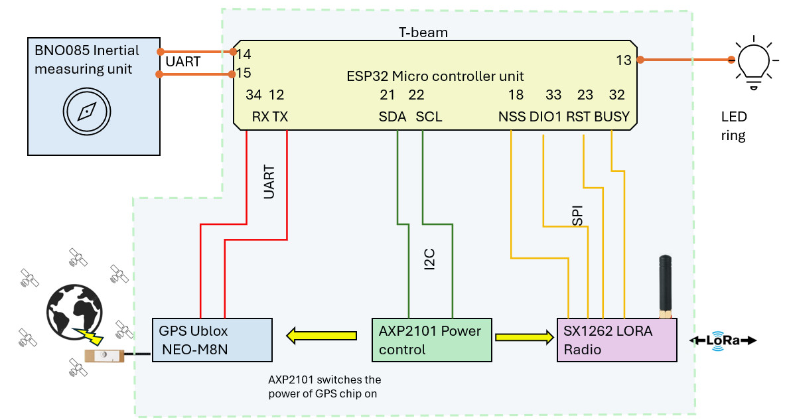

# Buddy finder compass LoRa Link (Sender + Receiver)

<!--
## The main idea:

It’s like a “hot-and-cold” game, but instead of saying “warmer,” it simply points you in the right direction with a light.
 
Imagine two friends each carrying a small “helper gadget” when they go hiking, exploring, or looking for something. 

It is "off grid", not depending on access to phone or internet  


## What the gadget does:
- ✅ It knows which way you are facing
Like a compass, it can tell whether you’re pointing toward north, south, east, or west. 

 
- ✅ It knows where your buddy is (roughly)
Your friend’s gadget and your gadget can “talk” to each other from far away, even if you can’t see each other.

 
- ✅ It tells you which direction to walk to reach them
Your gadget compares:

 
- ✅ where you are,
where your buddy is,
and which way you’re facing,
Then it figures out: “Your buddy is that way.”

 
- ✅ It shows the direction in a super simple way
Instead of showing a map or numbers, it uses a circle of lights:

 
- ✅ If the buddy is in front of you, the LED at the “front” glows.
If they’re to your left, the LED on the left glows.
If they’re behind you, a LED at the back glows.
So you just turn until the “go that way” LED is in front, then walk forward
 
 -->
## How you’d use it in real life:

### Situation A: Two people in the woods/mountains/desert
Both people carry one gadget.
If you get separated, look at your LED compass ring ring.
Turn your body until the “correct” LED is at the front.
Walk that way.
Check again sometimes (because your buddy may also be moving).
### Situation B: Finding your dog
Put one gadget on the dog’s collar, and carry the other yourself.
If the dog runs off, look at your lights.
Turn until the “correct” light is in front.
Walk that way, checking again as you go.

## Technical explanation

A minimal two-device project using **two LILYGO T-Beam V1.2 (ESP32 + SX1262)** boards to communicate over **LoRa** in the **EU 868 MHz** band.

The program is  a "ping - pong" program between two ESP32 (T-BEAM) with LORA communication. Both T-BEAM transmit regularly their GPS position to each other. 

Each LILYGO T-Beam LORA32 868MHz module is connected  with a BNO085 sensor through a UART bus. The LILYGO T-Beam serves as the main microcontroller and communication module, while the BNO085 sensor measures the spatial orientation of the device, i.e., where the device itself is pointing in relation to the North Pole.  Because the device knows its own orientation and also the location of the second "buddy" device, it now can calculate the direction in which the other buddy device is located. This direction is then displayed using a so-called WS2812B LED Pixel Individually Addressable Ring.

---

## What is LoRa?

**LoRa** (Long Range) is a wireless modulation technology developed by Semtech that enables low-power, long-range communication for IoT (Internet of Things) devices. It uses a proprietary spread-spectrum technique called Chirp Spread Spectrum (CSS) to achieve:

- **Long range:** Up to 15+ km in rural areas, 2-5 km in urban environments
- **Low power:** Devices can operate for years on a single battery
- **Low data rate:** Typically 0.3 kbps to 50 kbps (perfect for sensor data)
- **Excellent penetration:** Can penetrate buildings and obstacles better than WiFi/BLE

LoRa operates in the license-free ISM bands (868 MHz in Europe, 915 MHz in North America, 433 MHz in Asia). It's ideal for applications like:
- GPS tracking
- Environmental monitoring
- Smart agriculture
- Asset tracking
- Smart city sensors

---

## Software Overview

This repository contains the program "main" using the **RadioLib** library to control the **SX1262 LoRa radio** on the T-Beam.
In this branch GPS_bearing, the distance and bearing betwene "self" T-BEAM and "companion T-BEAM" is calculated.

## Program Logic (How it works)


### 1) **GPS Initialization & Configuration**

   - Powers the GPS module via the AXP2101 PMIC (power management IC) The program attempts to communicate with the AXP2101 chip (which manages the voltages). If it finds a signal, it activates the output that powers the GPS (3.3V). Otherwise, it displays a warning.




   - Configures the u-blox GPS to output only UBX binary protocol (disables NMEA sentences) Enables NAV-PVT (Position, Velocity, Time) messages at 1Hz rate on UART1
   - Initializing the GPS serial port:
    This opens a 9600 baud UART connection between the ESP32 and the GPS (pins 34 for receiving, 12 for transmitting).

   - Configuring the GPS:
    By default, the GPS sends many NMEA sentences (GGA, GSA, RMC, etc.). The program disables them all one by one by sending UBX configuration commands.

   - Then it activates a single UBX message called NAV-PVT (which contains the    position, speed, time, altitude, etc.).
    For each command, it waits for the GPS acknowledgment response (ACK or NAK) and displays whether it was successful.


### 2) **UBX Protocol Parsing**
   - Implements a robust state machine parser for UBX binary protocol
   - Extracts latitude, longitude, fix type, and validity flags from NAV-PVT frames
   - Stores the latest valid position data
   


### 3) (`main.cpp`)
This sketch makes two ESP32 T‑Beam boards “take turns” talking over LoRa. One board starts by sending a first message (because #define INITIATING_NODE is enabled). After that, the devices alternate like a ping‑pong game:


```csharp


operationDone = true; 


```


#### How it works (high level)
Each node normally stays in **LoRa receive mode (RX)**.
When a packet is received, an interrupt (DIO1) fires and the main loop reads and parses the payload.

To avoid RX/TX race conditions between the interrupt and the main loop, the firmware uses:
- a protected radio state (`IDLE`, `RX`, `TX`)
- an IRQ event counter (no lost interrupts)
- the ISR captures which operation (RX/TX) was active when the interrupt occurred

#### Link recovery (quiet channel is not a failure)
If both nodes end up listening (RX) and no packets arrive, the link can deadlock.
A periodic **maintenance transmission** is used to “kick” the link back into activity when no valid packet has been received for a while.

#### Real radio health check
Silence is treated as normal.
A hard recovery is only triggered if the SX1262 appears unresponsive over SPI (repeated failed IRQ flag reads).

#### Serial output
The firmware prints lines like:

```csharp
24.667753, 262.931436, 3, 3, true, true
```

#### State diagrams

```csharp
stateDiagram-v2
  [*] --> RX: startReceiveSafely()

  RX --> IDLE: IRQ(RX done) / handleRxEvent()
  IDLE --> RX: startReceiveSafely()

  RX --> IDLE: prepareForTransmit() + finishReceive()
  IDLE --> TX: startOwnTransmission() -> startTransmit()

  TX --> IDLE: IRQ(TX done) / handleTxEvent()
  IDLE --> RX: startReceiveSafely()

  state "Hard recovery" as REC
  RX --> REC: SPI health fails repeatedly
  TX --> REC: finishTransmit/startReceive fails badly
  IDLE --> REC: cannot restore RX
  REC --> RX: hardRadioReinit() success

```

#### Mermaid diagram

```csharp
flowchart TD
  A[loop() start: now=millis()] --> B{IRQ event pending? takeRadioEvent()}
  B -- yes --> C{eventOperation == TX?}
  C -- yes --> CTX[handleTxEvent(): finishTransmit -> startReceiveSafely]
  C -- no --> D{eventOperation == RX?}
  D -- yes --> CRX[handleRxEvent(): readData/parse -> startReceiveSafely]
  D -- no --> CX[Unexpected IRQ: force IDLE, clear events, restart RX]

  B -- no --> E{Maintenance TX due? \n(state==RX, no pending IRQ, timer expired)}
  E -- yes --> F{silentTime < grace?}
  F -- yes --> FS[Reschedule maintenance]
  F -- no --> G[startOwnTransmission():\nfinish RX -> TX -> send GPS]
  G --> FS

  E -- no --> H{Health check due?\n(state==RX, no pending IRQ, timer expired)}
  H -- yes --> I{getIrqFlags()==0xFFFFFFFF?}
  I -- yes --> J[Increment failures;\nif >=3 -> hardRadioReinit()]
  I -- no --> K[Reset failure counter]
  H -- no --> L{IDLE safety net?\n(state==IDLE, no pending IRQ)}
  L -- yes --> M[startReceiveSafely() else hardRadioReinit()]
  L -- no --> N[delay(1)]
  CTX --> N
  CRX --> N
  CX --> N
  FS --> N
  J --> N
  K --> N
  M --> N
  N --> A
```


### 4) Calculation of the angle and distance

For the distance calculation, the Haversine is used [Wikipedia about Haversine](https://en.wikipedia.org/wiki/Haversine_formula)

to find the bearing (direction angle) from one GPS point to another, the function treats Earth like a sphere and uses trigonometry. First, it converts both locations’ latitude and longitude from degrees to radians (because math functions expect radians). Then it looks at the difference in longitude between the two points and computes two values that represent how far “east/west” and “north/south” the second point is relative to the first on the globe. Using atan2(y, x), it turns those into an angle. Finally, it converts the angle back to degrees and normalizes it to 0–360°, where 0° is north, 90° east.

##### Terminal list during operation:
dist       angle     fix1,fix1, valid1, valid2 
17.166008, 143.877527, 3, 3, true, true
15.602145, 148.784867, 3, 3, true, true
15.526346, 141.979034, 3, 3, true, true
17.158990, 129.280774, 3, 3, true, true
...

## Features

- ✅ “ping pong” LoRa link 
- ✅ Pong calculates distance and bearing of Ping and vice-versa 
- ✅ Uses **EU 868 MHz** frequency
- ✅ Serial logging for easy debugging
- ✅ Built with **PlatformIO** + Arduino framework
- ✅ Uses **RadioLib** (SX1262 support)

---

## Hardware / Components Used

### Boards
- **2× LILYGO T-Beam V1.2**
  - MCU: **ESP32**
  - LoRa radio: **SX1262**
  - GPS: **NEO-M8N**
  - PMU: **AXP2101**
  - USB-UART: **CH9102**
  - Flash: 4MB, PSRAM: 8MB
  - Marking: *LILYGO 868/915 MHz Model: LORA32 SX1262*

### Region / Frequency
- **Europe (EU): 868 MHz** is used in the code:
  - `static const float LORA_FREQ = 868.0;`

> ⚠️ Always follow your local radio regulations (frequency, transmit power, duty cycle).

## Dependencies / Libraries Used
 - Arduino framework (ESP32)
 - a trimmed version of RadioLib by Jan Gromeš which is "inside" this project in a shortened form. For me, the full library takes about 8 min to compile, with this 'trimmed' Radiolib version, it's reduced to about 2 min. But this is only applicable for this very specific T-Beam version, which was available to me. If you want to take it out, please remove RadioLibTrim from the /lib folder.

	Used to control the SX1262 LoRa radio.
	In PlatformIO, you typically add:

	lib_deps =
	  jgromes/RadioLib
	Build & Flash (PlatformIO)

### Building and Uploading

#### Select the Environment

The project has two build defined in platformio.ini:

- **sender** - Compiles sender.cpp + SendOwnInfo.cpp (GPS transmission)
- **receiver** - Compiles only receive.cpp (LoRa receiver code)

Initiator project
Build (#define INITIATING_NODE is not commented out)
invitee project
Build (#define INITIATING_NODE is not commented out)


#### Build & Upload to Receiver T-Beam

```bash
# Using PlatformIO CLI
pio run -e receiver --target upload
```

#### Or in VS Code:
Click the "PlatformIO" icon → "Project Tasks" → "receiver" → "Upload"

#### Monitor Serial Output

```bash
# Monitor sender (GPS coordinates)
pio device monitor -e sender
```

#### Monitor receiver (received messages)
```bash
pio device monitor -e receiver
```

**Note:** If you have both T-Beams connected simultaneously, specify the correct COM port:
```bash
pio device monitor --port COM3   # Windows
pio device monitor --port /dev/ttyUSB0  # Linux/Mac
```

## Prerequisites
- Install VS Code
- ✅ Install the PlatformIO extension
- Connect your T-Beam via USB (CH9102 driver may be required depending on your OS)
- Compile & Upload
   


- Open the sender project and run:
- Build (#define INITIATING_NODE is not commented out)
- Upload
- Monitor (Serial Monitor at 115200 baud)
-Repeat for the receiver project, but comment out //#define INITIATING_NODE

-Serial Monitor Settings
-Baud rate: 115200

## Usage
-	Flash Receiver firmware to one T-Beam.
-	Flash Sender firmware to the other T-Beam.
-	Power both devices (USB or battery).
-	Ensure both use the same frequency (868.0)
-	Ensure LoRa parameters match (SF/BW/CR if you set them)
-	Verify antenna is connected
-	Verify correct SX1262 pin mapping (RST/BUSY/DIO1/NSS)

## Future Improvements
-	Add BNO085 IMU sensor and compass
-	Add a third Lora device, and develop triangulation or GPS calibration
- Testing out different LORA radio Parameters, like spreading etc
- adding  pygame based python scripts, that can simultaneously plot the route of the other beacon

## Graphical trace
One T-beam is left at home connected to the computer, and the Serial outprint is running. The other T-beam is taken along for a walk. Then the distance and angle log is imported to Excel. with the formular r*sin(alpha) and r*cos(alpha) in Excel form looking like  =A46*SIN(B46*PI()/180) and  =A46*COS(B46*PI()/180) , one can then generate a scatter chart.


A random background map was used just for illustration purpose.

## Acknowledgements
-	RadioLib library by Jan Gromeš and contributors
-	LILYGO for the T-Beam hardware platform
## License
-	This project is licensed under the GNU License. See the LICENSE file for details.

## Images
1. 

2. 

3.


